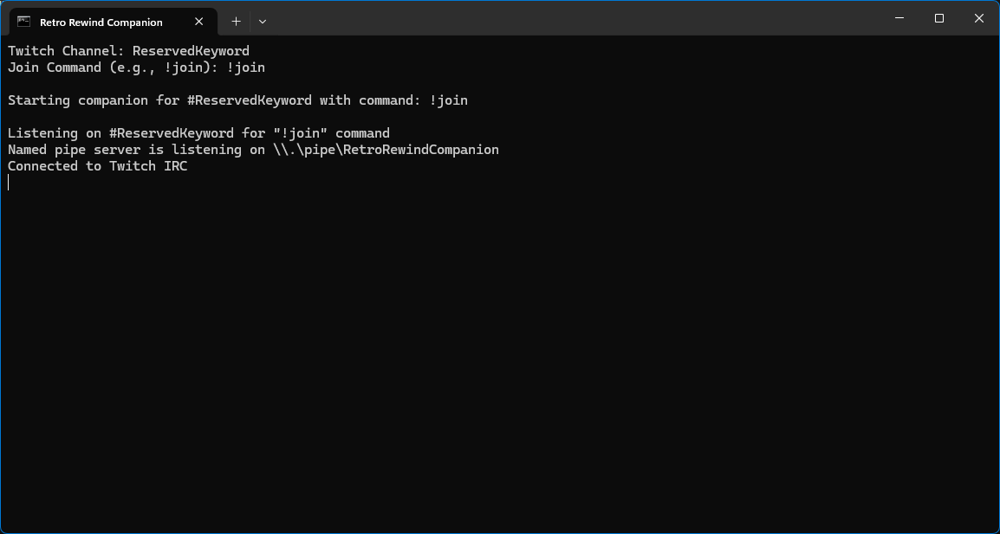

# Retro Rewind - Twitch Clients

This project is a Bun-based companion app for a UE4SS mod for the game, Retro Rewind, where Twitch chatters can become in-game customers.

## How It Works

This project has two (2) parts:

1. **Companion App**: A lightweight executable binary file (`.exe`) that connects to Twitch IRC and manages the chatter name queue. It communicates with the UE4SS mod via a [local named pipe](https://en.wikipedia.org/wiki/Named_pipe).

2. **UE4SS Mod**: A Lua script injected into Retro Rewind that intercepts when a customer spawns and when they indicate, after being given a flyer, that they would like to shop at your store, where their names are replaced with the next chatter in queue.

> [!NOTE]
> The companion app must be running (either in the background or foreground) before customers spawn for names to apply.

## Requirements

* Companion app binary (`retro-rewind-companion.exe`)
* [UE4SS experimental-latest](https://github.com/UE4SS-RE/RE-UE4SS/releases/tag/experimental-latest)

## Installation

### UE4SS

1. Download the UE4SS_v3.0.1-946-g265115c0 build from UE4SS' GitHub release page.

2. Navigate to your game's binary directory:
    ```
    {STEAM_LIBRARY}/steamapps/common/RetroRewind/RetroRewind/Binaries/Win64/
    ```

3. Extract the UE4SS zip archive into this directory — the `ue4ss` directory and the `dwmapi.dll` file.

4. In `ue4ss/UE4SS-settings.ini`, update `ConsoleEnabled = 0` to `ConsoleEnabled = 1` to see the UE4SS console, ensuring that the mod is loading and chatters are added to the game.

### Twitch Integration Mod

1. Copy the `TwitchIntegrationMod` directory, located inside the release zip archive, into the `ue4ss/Mods` directory.

2. Add `TwitchIntegrationMod : 1` to `ue4ss/Mods/mods.txt`

Your mod directory should look similar to the following:

```
ue4ss/
  Mods/
    TwitchIntegrationMod/
      Scripts/
        main.lua
      retro-rewind-companion.exe
      run-companion.bat
```

## Usage

### Start the Companion App

Run `run-companion.bat` to get prompted for the following information:

- **Twitch Channel** (required): Your Twitch channel

- **Join Command** (required): The chat command viewers will use (e.g., `!join`) to express intent to be an in-game character



### Launch the Game

Launch Retro Rewind via Steam. The UE4SS console should show similar to the following:

```
[TwitchIntegration] Waiting for game to load...
[RegisterHook] Registered script hook (5, 5) for Function /Game/VideoStore/core/ai/pawn/AI_Base_Character.AI_Base_Character_C:Return Random Name based on Genre
[RegisterHook] Registered script hook (6, 6) for Function /Game/VideoStore/asset/prop/Flyers/Flyer.Flyer_C:Give the Object
[RegisterHook] Registered script hook (7, 7) for Function /Game/VideoStore/asset/prop/Flyers/Flyer.Flyer_C:Walkby - Flyers End_Event
[TwitchIntegration] Hooks registered, ready for customers!
```

### Open Your Store

As customers spawn in game that already have intent to visit your store, their names are changed to Twitch chatters. The console logs each assignment, similar to the following:

```
[TwitchIntegration] Customer named: MyNewTwitchCustomer_1 (membership: 83787)
[TwitchIntegration] Customer named: MyNewTwitchCustomer_2 (membership: 84002)
```

### Hand Out Flyers

When giving a passerby a flyer, their decision process is logged, from handing them a flyer, to their final decision, and if they choose to visit your store, then their name change is logged, too.

```
# Failed Attempt
[TwitchIntegration] Flyer handed to a passerby, waiting for their decision...
[TwitchIntegration] Passerby declined the flyer.

# Successful Attempt
[TwitchIntegration] Flyer handed to a passerby, waiting for their decision...
[TwitchIntegration] Flyer convert named: MyNewTwitchCustomer_420
```